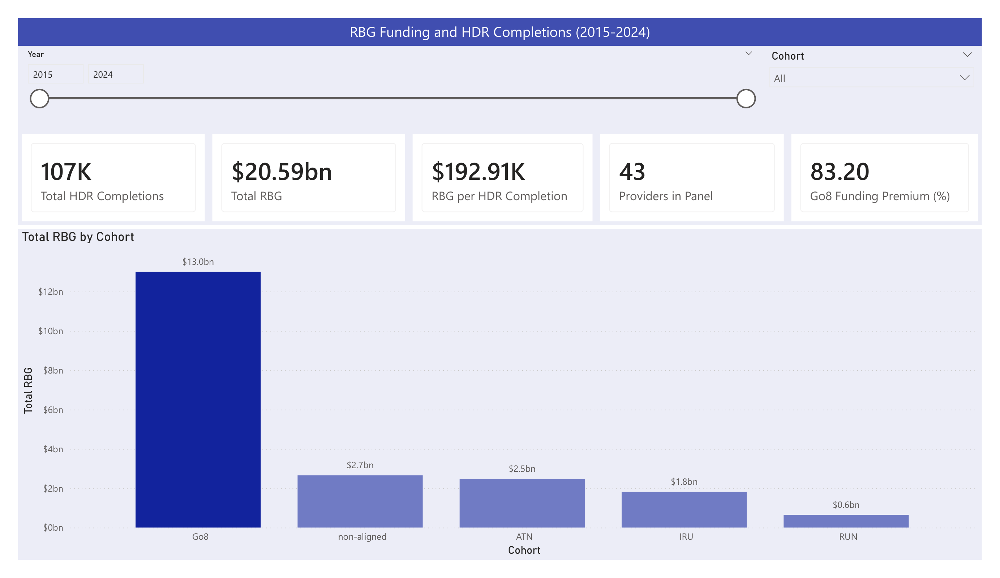
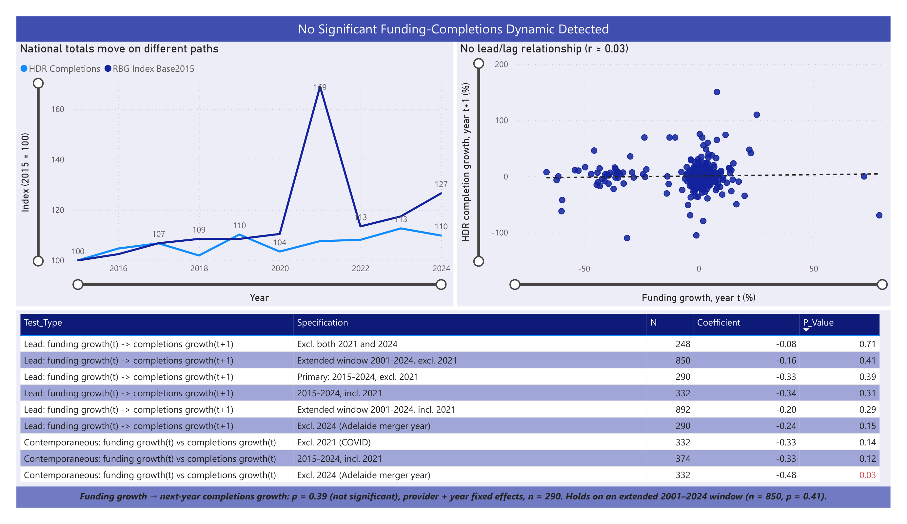
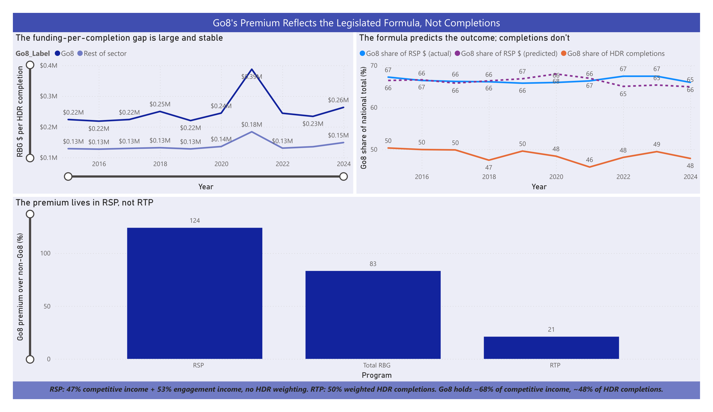

# Research Funding and HDR Completions

Analysis for a UTS Research Data Analytics internship task: do Research Block Grant (RBG)
allocations track, lead, or lag Higher Degree by Research (HDR) completions across
Australian higher education providers, and is any relationship concentrated in a few
institutions?

## Data sources

- [Higher Education Statistics](https://www.education.gov.au/higher-education-statistics)
  (Student Data collection) — Dept. of Education, Australian Government
- [Research block grant allocations time series](https://www.education.gov.au/research-block-grants/resources/research-block-grant-allocations-time-series)
  — Dept. of Education, Australian Government
- Official *Higher degree by research (HDR) student completions time series (1989–2024)*, https://www.education.gov.au/research-block-grants/resources/higher-degree-research-student-completions-time-series, used as an independent validation source
  (`data/hdr_official/`)
- [RSP](https://www.education.gov.au/research-block-grants/resources/calculation-research-support-program-allocations)
  and [RTP](https://www.education.gov.au/research-block-grants/resources/calculation-research-training-program-allocations)
  calculation methodology, and the [R&D income (HERDC) time series](https://www.education.gov.au/research-block-grants/resources/research-income-time-series)
  — used to test *why* Finding 2 holds, beyond the observed correlation (`data/methodology/`, `data/herdc_income/`)

All are public Australian Government documents/datasets; no data has been altered beyond the
cleaning steps documented below.

## Two findings

1. **No statistically significant funding–completions dynamic detected.** Raw levels
   correlation is high (r≈0.91), but that reflects persistent between-provider differences —
   of which scale is the most obvious, though not necessarily the only one — rather than a
   live dynamic. Year-on-year growth rates, with provider and year fixed effects, show no
   significant lead/lag relationship in either direction (p>0.14 across lags −3..+3, RTP vs.
   RSP, with/without 2021), and the null result gets *more* robust on an extended 2001–2024
   window (n=850, p=0.29–0.71). One isolated exception: the same-year
   relationship turns marginally significant (p=0.03, negative) specifically when 2024 is
   excluded — not replicated elsewhere, consistent with chance given the number of
   specifications tested.
2. **Go8's funding premium per HDR completion is mechanically explained by the legislated
   funding formulas, not by completions output.** RSP is legally 47% competitive R&D income
   share + 53% engagement income share (zero HDR completions weighting); RTP is 25%+25%
   income + 50% weighted HDR completions. Go8 holds ~68.5% of competitive income and ~64.2%
   of engagement income (far above its ~48% completions share) — reconstructing Go8's
   predicted RSP share from nothing but these income shares and the legislated weights
   reproduces its *actual* RSP share to within ~1.1 percentage points on average, every year.
   Regression premium: +83% Total RBG, +124% RSP (both p<0.0001), only +21% RTP (p=0.10,
   n.s.) — precisely because RTP's formula is half-diluted by the completions component RSP
   doesn't have. Holds independently at all 8 Go8 universities (1.56x–2.24x the non-Go8
   average; not 2–3 outliers).

### Robustness checks

Both findings were stress-tested against: alternative numerator/denominator combinations,
the RSP sub-component / formula investigation above, an extended time window (2001–2024)
and individual-year exclusions, and an institution-by-institution breakdown within Go8. The
RSP/RTP formula documents and HERDC income data used for that investigation are what
elevated Finding 2 from an observed pattern to a mechanistically validated one.

## Repo structure

```
data/
  student/        Higher Education Statistics raw downloads + pivot-cache reconstruction
  rbg/             RBG allocations time series (raw + tidy long format)
  hdr_official/    Official HDR completions time series (cross-check source)
  clean/           Final cleaned panel (output of the pipeline)
  powerbi/         Clean extracts for the Power BI dashboard (see POWERBI_GUIDE.md)
scripts/           All data cleaning, crosswalk, analysis, and chart-generation code
charts/            Generated chart PNGs (Finding 1, Finding 2, pipeline diagram)
dashboard/
  screenshots/     Power BI dashboard page screenshots, used in this README
POWERBI_GUIDE.md    Power BI dashboard technical notes: data model, DAX measures, page design
```

## Power BI dashboard

Built in Power BI, reading from the extracts in `data/powerbi/`. Three pages: an overview
with sector-wide KPIs, and one page per finding, mirroring the two finding charts in `charts/` with
interactive slicers on top.

**Overview**: headline KPIs (completions, funding, Go8 premium), filterable by year and cohort.


**Finding 1 — No significant funding-completions dynamic**: indexed national totals, the
provider-level growth scatter, and the full robustness-check table across both the lead and
contemporaneous specifications.


**Finding 2 — Go8's premium reflects the legislated formula**: the funding-per-completion
gap over time, the predicted-vs-actual RSP share validation, and the premium by program.


The `.pbix` file itself isn't in this repo (large binary, doesn't suit git well). Screenshots
are the way to see it here — the free Power BI license used for this project doesn't include
the Publish to Web or Share features, so there's no live link.

`data/powerbi/` has six ready-to-load CSVs (base panel, precomputed YoY growth, a lead/lag
pairing table, a robustness-check summary, and the clustered-SE regression + legislated-
formula-validation results Power BI can't reproduce natively). `POWERBI_GUIDE.md` documents
the data model, DAX measures, and page-by-page design decisions behind the dashboard above.

## Reproducing the pipeline

```
pip install -r requirements.txt

python scripts/parse_completions_pivot.py       # reconstruct 2020-2024 HDR data from the Excel pivot cache
python scripts/parse_legacy_completions.py      # parse 2015-2019 legacy Section 14 / Table 8 workbooks
python scripts/build_crosswalk.py               # verify the HEP-Code name crosswalk resolves cleanly
python scripts/build_master_panel_v2.py         # build the final panel (completions from the official file + RBG)

python scripts/eda_01_overview.py               # national totals, growth rates, panel balance
python scripts/eda_02_lag_analysis.py           # growth-rate lead/lag correlations, pooled vs. fixed-effects
python scripts/eda_03_concentration.py          # Go8 share, rank stability, concentration checks
python scripts/eda_04_regression.py             # formal panel regressions (statsmodels)

python scripts/build_go8_mechanism_validation.py  # reconstruct Go8's predicted RSP share from HERDC income + legislated weights
python scripts/chart_pipeline.py                # pipeline diagram
python scripts/chart_finding1.py                # Finding 1 chart
python scripts/chart_finding2.py                # Finding 2 chart
python scripts/build_report.py                  # PDF report

python scripts/build_powerbi_extract.py         # data/powerbi/powerbi_panel.csv, powerbi_growth.csv
python scripts/build_powerbi_leadlag.py         # data/powerbi/powerbi_leadlag_pairs.csv
python scripts/build_powerbi_extract_v2.py      # remaining data/powerbi/ tables (robustness checks, mechanism validation, premium results)
```

`build_master_panel.py` (v1) is kept for reference — it's the original pivot-cache-only
completions build. It was superseded by `build_master_panel_v2.py` after cross-checking
against the official HDR file revealed a classification gap in the pivot tool's HDR bucket
during COVID-affected years.

## Key methodology notes

- **Provider name crosswalk**: institution names drift across years and files (e.g.
  `CQUniversity` vs. `Central Queensland University`, `RMIT University` vs. its RBG legal
  name `Royal Melbourne Institute of Technology`). Resolved with a canonical HEP-Code
  crosswalk anchored on the RBG file's provider list (`scripts/build_crosswalk.py`).
- **2017 RBG program consolidation**: six legacy programs were replaced by RTP/RSP;
  aggregated to program families for comparability.
- **2021 COVID-19 anomaly**: a documented one-off RSP top-up plus a completions dip in the
  same year; excluded from the primary growth-rate specification, included as a robustness
  check.
- **Suppressed cells** (`<5` / `np`) are imputed at the interval midpoint and flagged, not
  silently dropped.

## Requirements

Python 3.10+, see `requirements.txt` (pandas, numpy, openpyxl, xlrd, statsmodels,
matplotlib, reportlab, pypdf).
